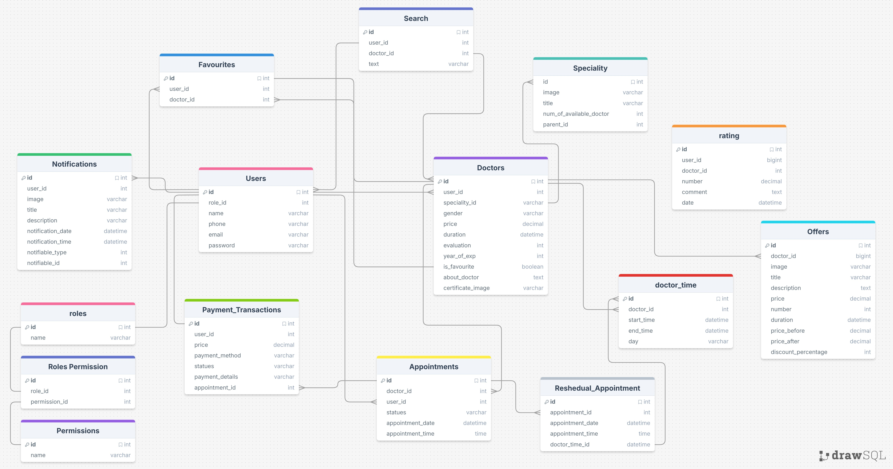
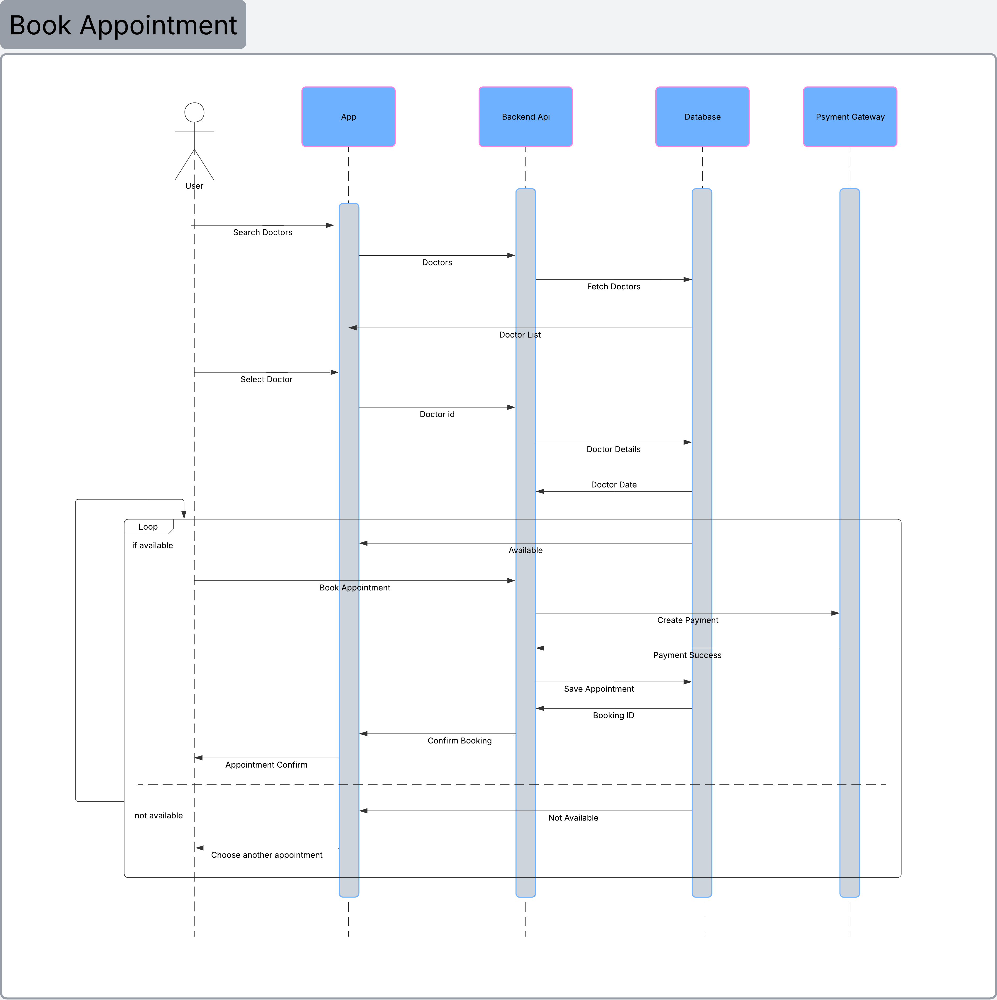
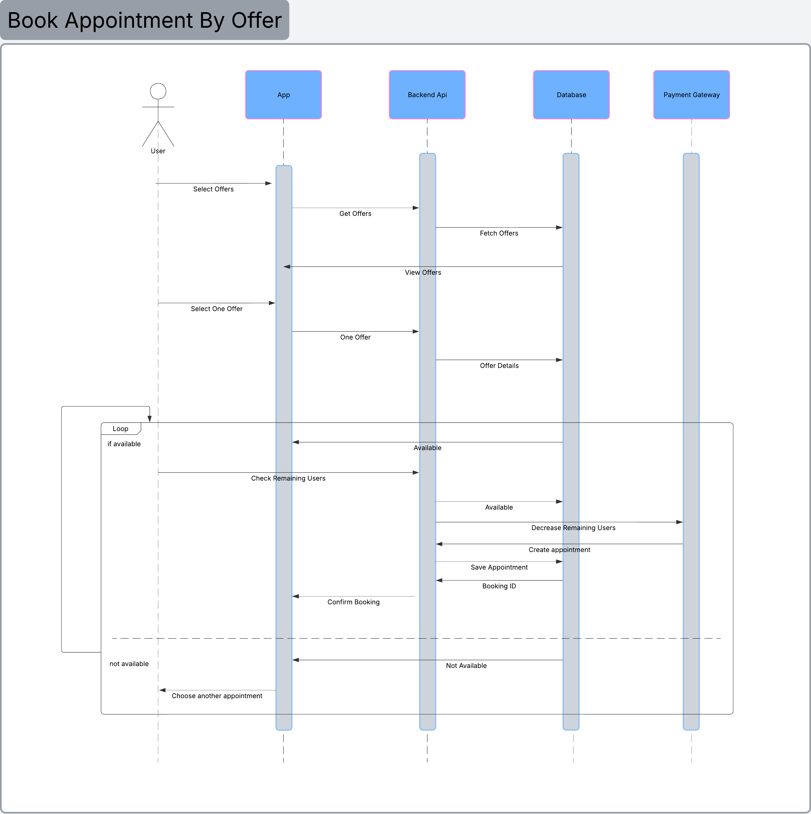
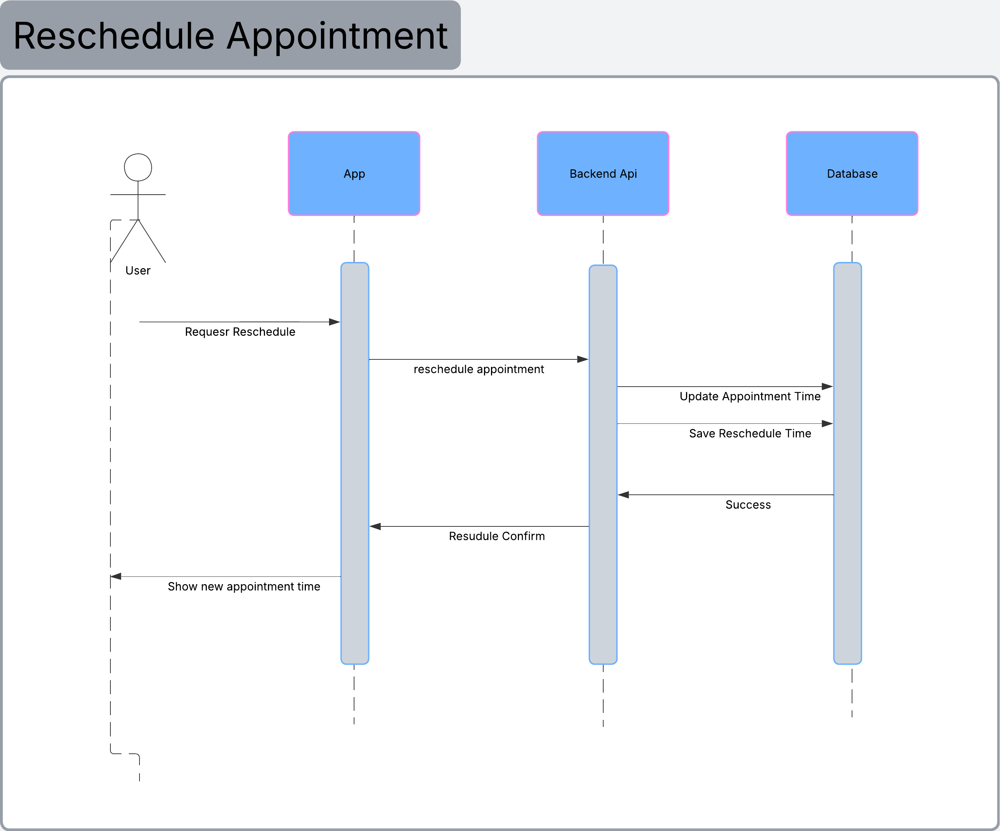
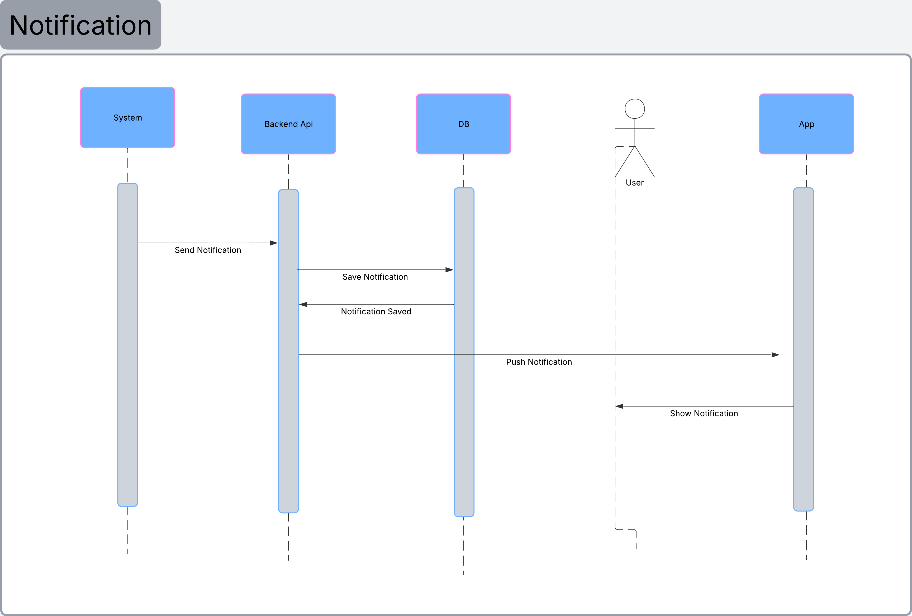
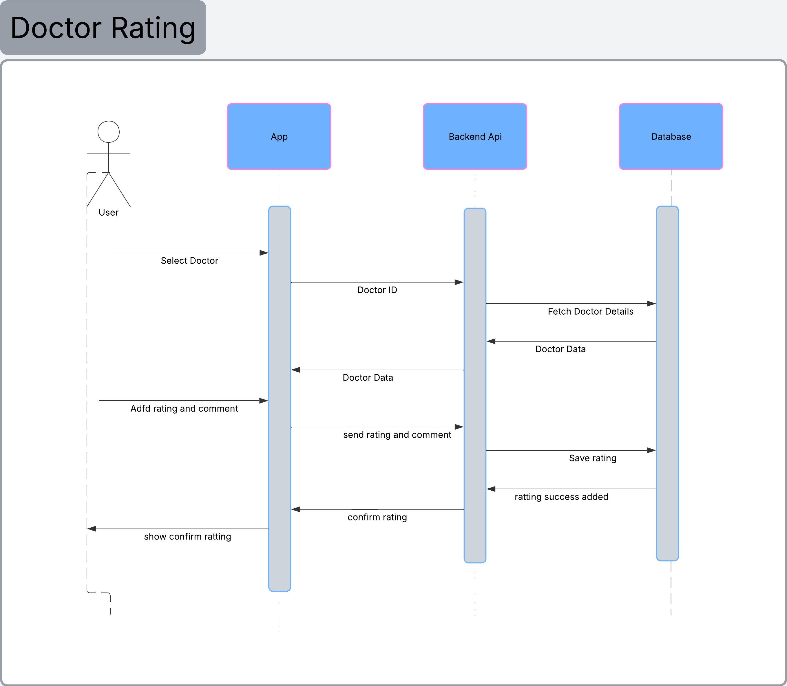
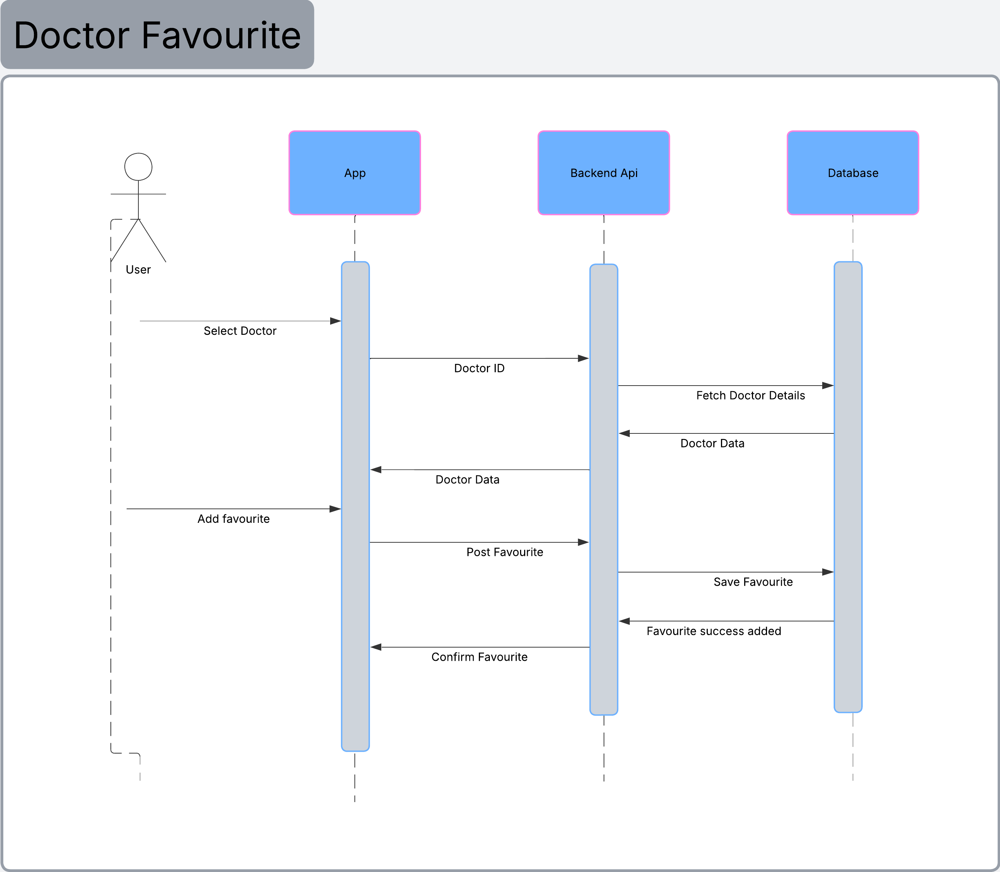

## Medical application

#### About App
Medical application connects clients to the medical center to facilitate electronic payment and appointment booking.
Medical files management, booking and discounts within the application, and booking and managing medical files.

#### UI
- [Figma- UI](https://www.figma.com/proto/jGwEgd4VjPKUXFRTconDRh/%D8%AA%D8%B7%D8%A8%D9%8A%D9%82-%D8%B7%D8%A8%D9%89-CP-50-i17?node-id=717-45790&p=f&t=pdHQy6p8pIhFqcth-0&scaling=scale-down&content-scaling=fixed&page-id=0%3A1&starting-point-node-id=10%3A4648)

#### API Documentation
- [Postman Documentation](https://documenter.getpostman.com/view/50716080/2sBXiqFUYM)

#### ERD:


#### sequence diagrams:

- Book appointment by doctor


- Book appointment by offer


- Resudule Appointment


- Notification


- Confirm Rating


- Doctor Favourite


#### structure:

``` 
src/
│
├── modules/
│   │
│   ├── auth/
│   │   ├── register/
│   │   ├── verify/
│   │   ├── login/
│   │   ├── forgot-password/
│   │   └── reset-password/
│   │
│   ├── profile/
│   │   ├── show-profile/
│   │   ├── update-profile/
│   │   ├── change-email/
│   │   └── change-phone/
│   │
│   ├── settings/
│   │   └── update-settings/
│   │
│   ├── notifications/
│   │   ├── list/
│   │   ├── read/
│   │   ├── delete/
│   │   └── mark-all-read/
│   │
│   ├── home/
│   │   ├── static-pages/
│   │   └── core-features/
│   │
│   │
│   ├── admin/
│   │   ├── auth/
│   │   │   └── login/
│   │   │
│   │   ├── profile/
│   │   │   ├── view/
│   │   │   └── update/
│   │   │
│   │   ├── settings/
│   │   │   └── manage/
│   │   │
│   │   ├── locations/
│   │   │   ├── countries/
│   │   │   │   └── CRUD/
│   │   │   └── cities/
│   │   │       └── CRUD/
│   │   │
│   │   ├── notifications/
│   │   │   ├── send-push/
│   │   │   └── manage/
│   │   │
│   │   ├── static-pages/
│   │   │   ├── create/
│   │   │   └── update/
│   │   │
│   │   └── core-features/
│   │       └── CRUD/
│
├── middlewares/
├── utils/
├── config/
└── routes/
```
